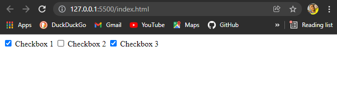

# Custom Checkbox
## This project is for devs looking to customize 'the checkbox input tag', to their taste, with fewer lines of CSS

### Here is what a traditional checkbox looks like:

### And this is what our custom checkbox looks like: 
### creating the Checkmark, proved a little challenging.
### Good thing, coz we'd be using the "clip-path" property to design that.
### if you're interested in using the "Clip-Path" free online tool, to draw your own shapes or instantly pick up new ones. Use this link [Handy Clip Path Generator](https://bennettfeely.com/clippy/)

### This theme could  very much be adjusted to your taste, i mean that's essential why this project exists.
### GodSpeed!

### If you're a javascript dev, you might wanna give me a follow on twitter: [twitter.com/chukwuebukaonuh](https://www.twitter.com/chukwuebukaonuh)